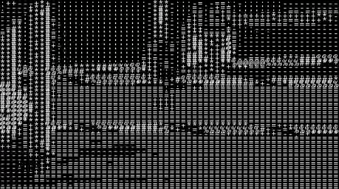

# ASCII-ify

Convert webcam feeds, images, or videos into ASCII art directly in your browser. Try it out [here](https://mwpryer.github.io/ascii-ify/).

<div align="center">
  
  
</div>

## Features

Transform media into ASCII art in real-time using your webcam or uploaded files. Key features include:

- Real-time webcam feed conversion
- Support for image and video file uploads
- Customisable output dimensions, character sets, and colours
- Copy ASCII to clipboard or download it as a PNG.

## How It Works

### ASCII Conversion

The core algorithm transforms visual media into ASCII art through the following steps:

1. **Pixel Sampling**: For each ASCII character position, a grid of pixels is sampled from the source image or video. Within each region, RGB values are averaged to determine overall brightness. A stride pattern optimises performance by sampling fewer pixels in larger regions.

2. **Luminance Calculation**: The averaged RGB values are converted to a single luminance value using the ITU-R BT.709 coefficients, which reflect human perception of colour (green appears brighter than blue or red).

   ```math
   Luminance = (R * 0.2126) + (G * 0.7152) + (B * 0.0722)
   ```

3. **Character Mapping**: The luminance value (0-255) is mapped to an index in the selected character set. Higher luminance values correspond to denser characters (like `@` or `#`), while lower values correspond to sparser characters (like spaces or dots).

### Technical Details

The application is built using React with a focus on modular components and custom hooks. State management is handled via React Context.

Custom hooks abstract the core application logic:

- **`useWebcam`**: Manages webcam streams and previews
- **`useUpload`**: Handles file uploads and previews
- **`useAscii`**: Implements the core ASCII conversion logic and output

## Resources

- [ASCII Character Sets](https://paulbourke.net/dataformats/asciiart/)
- [Luminance Calculation](https://en.wikipedia.org/wiki/Grayscale#Luma_coding_in_video_systems)
